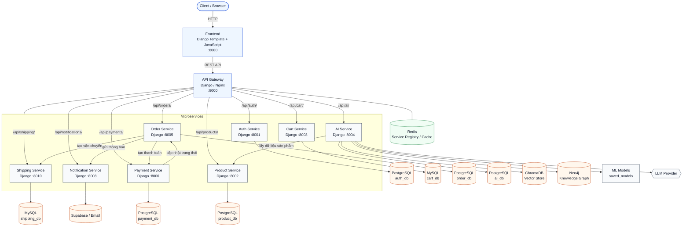

# Chương 4: Xây Dựng Hệ Thống Hoàn Chỉnh

## 4.1 Tổng Quan Hệ Thống

Sau khi phân tích yêu cầu, phân rã hệ thống theo Domain-Driven Design và thiết kế các thành phần AI, dự án được triển khai thành một hệ thống thương mại điện tử theo kiến trúc microservices. Mỗi service đảm nhiệm một miền nghiệp vụ riêng, có database riêng và giao tiếp với nhau thông qua REST API.

Hệ thống gồm các nhóm chức năng chính:

- Quản lý người dùng, xác thực và phân quyền.
- Quản lý danh mục, sản phẩm và biến thể sản phẩm.
- Quản lý giỏ hàng, đặt hàng, thanh toán và vận chuyển.
- Quản lý tồn kho, mã giảm giá, đánh giá sản phẩm và thông báo.
- AI Service phục vụ gợi ý sản phẩm, phân tích hành vi người dùng và chatbot tư vấn.

Kiến trúc tổng thể:



Trong đó, API Gateway đóng vai trò là điểm truy cập duy nhất từ phía frontend. Các request từ người dùng được gửi đến API Gateway, sau đó được định tuyến đến service tương ứng.

## 4.2 Kiến Trúc Microservices

Hệ thống được chia thành nhiều service độc lập. Mỗi service đại diện cho một bounded context trong thiết kế DDD.

| Service | Port | Trách nhiệm chính | Database / Storage |
|---|---:|---|---|
| API Gateway | 8000 | Định tuyến request, xác thực JWT, forward identity | Redis / Service Registry |
| Auth Service | 8001 | Đăng ký, đăng nhập, JWT, hồ sơ người dùng | PostgreSQL |
| Product Service | 8002 | Sản phẩm, danh mục, phân loại sản phẩm | PostgreSQL |
| Cart Service | 8003 | Giỏ hàng user/guest | MySQL |
| AI Service | 8004 | Gợi ý sản phẩm, RAG chatbot, ML behavior | PostgreSQL, Neo4j, ChromaDB |
| Order Service | 8005 | Đơn hàng, chi tiết đơn hàng, trạng thái đơn | PostgreSQL |
| Payment Service | 8006 | Thanh toán, hoàn tiền, giao tiếp order | PostgreSQL |
| Inventory Service | 8007 | Tồn kho, reserve/release/deduct stock | MySQL |
| Notification Service | 8008 | Email/thông báo trạng thái đơn hàng | Supabase / Email |
| Review Service | 8009 | Rating, comment, verified purchase | PostgreSQL |
| Shipping Service | 8010 | Phương thức vận chuyển, tracking | MySQL |
| Coupon Service | 8011 | Mã giảm giá, usage limit, validate coupon | PostgreSQL |
| Frontend | 8080 | Giao diện người dùng | Không có DB riêng |
| Neo4j | 7474 / 7687 | Knowledge Graph | Neo4j volume |
| Redis | 6379 | Service registry/cache/session support | Redis |

Việc tách service giúp hệ thống dễ bảo trì, dễ mở rộng và cho phép từng domain thay đổi độc lập.

## 4.3 API Gateway Và Cơ Chế Giao Tiếp

API Gateway là lớp trung gian giữa frontend và các microservice. Gateway đảm nhiệm các nhiệm vụ:

- Nhận request từ frontend.
- Decode JWT để xác định `user_id`, `role`, quyền admin.
- Tạo và forward `session_id` cho guest user.
- Kiểm tra quyền truy cập public, authenticated, admin hoặc service-only.
- Forward request đến service đích.
- Gắn các header định danh như `X-User-Id`, `X-Role`, `X-Session-Id`.

Ví dụ request từ frontend:

```text
GET /api/products/
POST /api/cart/items/
POST /api/ai/chat/
GET /api/ai/recommendations/personalized/
```

Gateway sẽ ánh xạ các prefix API đến service tương ứng:

```text
/api/auth/        -> auth-service
/api/products/    -> product-service
/api/cart/        -> cart-service
/api/orders/      -> order-service
/api/payments/    -> payment-service
/api/ai/          -> ai-service
/api/reviews/     -> review-service
```

Đối với người dùng chưa đăng nhập, hệ thống vẫn hỗ trợ guest session cho cart và AI tracking thông qua cookie `session_id`.

## 4.4 Product Service

Product Service quản lý danh mục sản phẩm và thông tin sản phẩm. Đây là một trong các core domain của hệ thống thương mại điện tử.

Các entity chính:

- `Category`: danh mục cấp cha.
- `SubCategory`: danh mục con.
- `Product`: sản phẩm chung.
- `ComputerProduct`: thông tin riêng cho máy tính.
- `MobileProduct`: thông tin riêng cho điện thoại.
- `ClothesProduct`: thông tin riêng cho quần áo.

Mô hình sản phẩm tổng quát:

```python
class Product(models.Model):
    name = models.CharField(max_length=300)
    description = models.TextField(blank=True, default='')
    price = models.DecimalField(max_digits=10, decimal_places=2)
    stock = models.PositiveIntegerField(default=0)
    category = models.ForeignKey(Category, on_delete=models.SET_NULL, null=True)
    subcategory = models.ForeignKey(SubCategory, on_delete=models.SET_NULL, null=True)
    image_url = models.URLField(max_length=500, blank=True, default='')
    is_active = models.BooleanField(default=True)
```

Product Service cung cấp API cho frontend và các service khác lấy danh sách sản phẩm, chi tiết sản phẩm, danh mục và tồn kho hiển thị.

## 4.5 Quy Trình Mua Hàng Hoàn Chỉnh

Luồng mua hàng trong hệ thống được phối hợp giữa nhiều service:

```text
User
 -> Product Service: xem sản phẩm
 -> Cart Service: thêm vào giỏ hàng
 -> Coupon Service: áp dụng mã giảm giá
 -> Order Service: tạo đơn hàng
 -> Inventory Service: kiểm tra/reserve tồn kho
 -> Payment Service: xử lý thanh toán
 -> Shipping Service: tạo shipment
 -> Notification Service: gửi thông báo
 -> Review Service: đánh giá sau mua
```

### 4.5.1 Giỏ Hàng

Cart Service lưu giỏ hàng cho cả người dùng đăng nhập và guest user. Với guest user, hệ thống dùng `session_id` do API Gateway tạo. Khi người dùng đăng nhập, guest cart có thể được merge vào user cart.

### 4.5.2 Đặt Hàng

Order Service tạo đơn hàng từ giỏ hàng. Khi tạo đơn, service lưu snapshot thông tin sản phẩm như tên sản phẩm, giá tại thời điểm mua và số lượng. Điều này giúp lịch sử đơn hàng không bị thay đổi nếu giá sản phẩm thay đổi sau này.

### 4.5.3 Thanh Toán Và Vận Chuyển

Payment Service xử lý thanh toán và cập nhật trạng thái đơn hàng. Shipping Service quản lý phương thức vận chuyển, chi phí giao hàng, tracking number và lịch sử tracking.

### 4.5.4 Tồn Kho

Inventory Service chịu trách nhiệm reserve, release và deduct stock. Việc tách tồn kho thành service riêng giúp tránh việc Product Service phải xử lý toàn bộ logic giao dịch phức tạp.

## 4.6 AI Service

AI Service là thành phần tạo điểm khác biệt cho hệ thống. Service này đảm nhiệm các chức năng:

- Thu thập hành vi người dùng.
- Huấn luyện và inference mô hình hành vi.
- Gợi ý sản phẩm cá nhân hóa.
- Dự đoán sản phẩm tiếp theo.
- Lưu và khai thác Knowledge Graph bằng Neo4j.
- Tư vấn sản phẩm bằng RAG chatbot.

AI Service sử dụng nhiều loại lưu trữ:

| Storage | Vai trò |
|---|---|
| PostgreSQL | Lưu `BehaviorEvent`, `UserBehaviorProfile`, chat session, recommendation logs |
| ChromaDB | Lưu vector embedding cho sản phẩm và tài liệu |
| Neo4j | Lưu Knowledge Graph, quan hệ user-session-action-product |
| File system | Lưu model checkpoint tại `ai_service/ml/saved_models` |

## 4.7 Thu Thập Hành Vi Người Dùng

AI Service ghi nhận hành vi người dùng thông qua các event. Mỗi event biểu diễn một hành động của người dùng trong quá trình mua sắm.

Các event chính:

```text
page_view
product_view
add_to_cart
remove_from_cart
search
category_filter
checkout
```

Dữ liệu hành vi được lưu trong bảng `behavior_events`. Các trường quan trọng gồm:

| Trường | Ý nghĩa |
|---|---|
| `user_id` | Người dùng đã đăng nhập |
| `session_id` | Phiên truy cập của guest user |
| `event_type` | Loại hành vi |
| `product_id` | Sản phẩm liên quan |
| `category_id` | Danh mục liên quan |
| `search_query` | Từ khóa tìm kiếm |
| `metadata` | Thông tin bổ sung như giá, số lượng, thiết bị |
| `created_at` | Thời điểm phát sinh event |

Sau khi lưu vào PostgreSQL, event được đồng bộ sang Neo4j theo cơ chế best-effort. Nếu Neo4j tạm thời lỗi, việc tracking hành vi vẫn không làm hỏng request chính.

## 4.8 Mô Hình Machine Learning

Hệ thống có hai hướng mô hình chính.

### 4.8.1 Behavior Model

Behavior Model dùng để phân tích hành vi người dùng và dự đoán:

- Intent của người dùng: `browsing`, `buying`, `comparing`, `returning`.
- Danh mục người dùng có xu hướng quan tâm.
- Xác suất mua hàng.

Kiến trúc model:

```text
Event sequence
 -> Event embedding
 -> Category embedding
 -> Numerical features
 -> RNN/LSTM/BiLSTM
 -> Attention
 -> Shared dense layers
 -> Intent head
 -> Category head
 -> Purchase likelihood head
```

Trong đó, BiLSTM + Attention giúp mô hình học được các hành vi quan trọng trong chuỗi tương tác của người dùng.

### 4.8.2 Next-Product Prediction

Mô hình next-product prediction dự đoán sản phẩm tiếp theo mà người dùng có khả năng quan tâm dựa trên lịch sử tương tác.

Input của model:

```text
product_id, action, category, device
```

Pipeline xử lý:

```text
data_user500.csv
 -> group events theo user_id
 -> sort theo timestamp
 -> tạo sliding-window samples
 -> train RNN / LSTM / BiLSTM
 -> lưu checkpoint
```

Ba mô hình được so sánh:

- RNN: baseline đơn giản.
- LSTM: học chuỗi hành vi tốt hơn RNN.
- BiLSTM: học ngữ cảnh hai chiều, ranking tốt hơn nhưng chi phí cao hơn.

Kết quả checkpoint hiện tại:

| Model | Val Loss | Test Loss | Accuracy@1 | Accuracy@5 | MRR@5 |
|---|---:|---:|---:|---:|---:|
| RNN | 4.5685 | 4.5173 | 2.00% | 10.00% | 0.0447 |
| LSTM | 4.4920 | 4.4841 | 1.43% | 10.00% | 0.0430 |
| BiLSTM | 4.5161 | 4.5010 | 2.00% | 11.43% | 0.0509 |

BiLSTM có ranking metric tốt nhất, trong khi LSTM có validation/test loss thấp nhất. Vì vậy, LSTM được chọn làm model ưu tiên cho inference realtime do cân bằng giữa độ ổn định và chi phí triển khai.

## 4.9 Recommendation Engine

AI Service cung cấp nhiều loại recommendation:

| API | Chức năng |
|---|---|
| `GET /api/ai/recommendations/personalized/` | Gợi ý cá nhân hóa |
| `GET /api/ai/recommendations/similar/{product_id}/` | Sản phẩm tương tự |
| `GET /api/ai/recommendations/also-bought/{product_id}/` | Sản phẩm thường mua cùng |
| `GET /api/ai/recommendations/trending/` | Sản phẩm phổ biến |
| `GET /api/ai/recommendations/cart/` | Gợi ý dựa trên giỏ hàng |
| `GET /api/ai/recommendations/search/` | Gợi ý theo truy vấn tìm kiếm |
| `POST /api/ai/recommendations/next-product/` | Dự đoán sản phẩm tiếp theo |

Recommendation engine kết hợp nhiều tín hiệu:

- Collaborative filtering.
- Content-based similarity.
- ML category preference.
- Trending products.

Trọng số mặc định:

```python
BASE_WEIGHTS = {
    "collaborative": 0.40,
    "content": 0.30,
    "ml": 0.20,
    "trending": 0.10,
}
```

Ngoài ra, hệ thống điều chỉnh trọng số theo intent:

- `buying`: ưu tiên collaborative.
- `comparing`: ưu tiên content-based/similar products.
- `browsing`: cân bằng content, collaborative và trending.
- `returning`: tăng trọng số trending để tránh lặp lại sản phẩm cũ.

Với cold-start user, hệ thống fallback sang trending products.

## 4.10 Knowledge Graph Với Neo4j

Knowledge Graph được xây dựng bằng Neo4j để biểu diễn quan hệ giữa người dùng, phiên truy cập, hành động, thiết bị và sản phẩm.

Schema chính:

```text
(User)-[:HAS_SESSION]->(Session)
(Session)-[:PERFORMED]->(Action)
(Action)-[:ON_PRODUCT]->(Product)
(Session)-[:USED_DEVICE]->(Device)
(User)-[:INTERESTED_IN]->(Product)
(User)-[:PURCHASED]->(Product)
(BehaviorEvent)-[:ON_PRODUCT]->(Product)
(BehaviorEvent)-[:IN_CATEGORY]->(Category)
```

Ví dụ truy vấn sản phẩm được quan tâm nhiều nhất:

```cypher
MATCH (u:User)-[:INTERESTED_IN]->(p:Product)
RETURN p.product_id AS product_id,
       p.name AS product_name,
       p.category AS category,
       count(u) AS interest_count
ORDER BY interest_count DESC
LIMIT 10
```

Neo4j còn được dùng cho Graph QA. Khi người dùng hỏi các câu liên quan đến hành vi như "sản phẩm nào được mua nhiều nhất" hoặc "người dùng này quan tâm sản phẩm gì", hệ thống có thể chuyển câu hỏi tự nhiên thành Cypher, chạy truy vấn trên Neo4j và dùng LLM diễn giải kết quả.

## 4.11 RAG Chatbot

Chatbot tư vấn sử dụng Retrieval-Augmented Generation. Pipeline gồm:

```text
User question
 -> kiểm tra loại câu hỏi
 -> nếu là behavior query: Graph QA với Neo4j
 -> nếu là product/policy query: semantic retrieval bằng ChromaDB
 -> bổ sung context từ Neo4j nếu có
 -> LLM sinh câu trả lời
 -> trả response + sources + product links
```

Vector database sử dụng ChromaDB, embedding model mặc định:

```text
sentence-transformers/paraphrase-multilingual-MiniLM-L12-v2
```

LLM provider hiện tại:

```text
Gemini API - gemini-2.5-flash
```

Hệ thống vẫn hỗ trợ fallback sang OpenAI hoặc Ollama thông qua biến môi trường.

Endpoint chatbot:

```http
POST /api/ai/chat/
```

Body:

```json
{
  "message": "Tôi cần laptop giá rẻ",
  "chat_session_id": null
}
```

Response:

```json
{
  "response": "Dựa trên nhu cầu của bạn, tôi gợi ý một số sản phẩm phù hợp...",
  "sources": [
    {
      "source": "product_301",
      "source_type": "product",
      "product_name": "Laptop Acer Aspire",
      "product_id": "301"
    }
  ],
  "chat_session_id": "..."
}
```

Chatbot không chỉ trả lời bằng ngôn ngữ tự nhiên mà còn trả về `sources` để frontend hiển thị link đến sản phẩm liên quan.

## 4.12 Review Service

Review Service cho phép người dùng đánh giá sản phẩm bằng rating và comment.

Các chức năng chính:

- Tạo review cho sản phẩm.
- Lấy danh sách review theo sản phẩm.
- Tính điểm trung bình rating.
- Thống kê phân phối số sao.
- Kiểm tra verified purchase thông qua Order Service.

Model chính:

```python
class Review(models.Model):
    product_id = models.IntegerField(db_index=True)
    user_id = models.IntegerField()
    rating = models.IntegerField()
    title = models.CharField(max_length=200, blank=True, default='')
    comment = models.TextField(blank=True, default='')
    is_verified_purchase = models.BooleanField(default=False)
    is_approved = models.BooleanField(default=True)
```

Hiện tại, rating/comment đã được lưu và hiển thị trên UI sản phẩm. Tuy nhiên, review feedback chưa được tích hợp trực tiếp vào thuật toán recommendation. Đây là hướng phát triển tiếp theo của hệ thống.

## 4.13 Frontend

Frontend được xây dựng bằng Django template và JavaScript. Frontend gọi API Gateway để lấy dữ liệu từ các service.

Các màn hình chính:

- Trang chủ: hiển thị sản phẩm, personalized recommendations và trending products.
- Trang chi tiết sản phẩm: hiển thị thông tin sản phẩm, review, similar products, also-bought và next-product recommendation.
- Trang giỏ hàng: hiển thị cart items và cart-based recommendations.
- Trang chatbot: giao diện tư vấn AI.
- Trang login/register/profile.

Frontend tích hợp tracking hành vi người dùng. Các hành vi như xem sản phẩm, tìm kiếm, thêm vào giỏ hàng được gửi về AI Service để phục vụ cá nhân hóa.

## 4.14 Triển Khai Bằng Docker

Toàn bộ hệ thống được triển khai bằng Docker Compose. Mỗi service chạy trong container riêng. AI Service chạy tại:

```text
ai-service:8004
```

Neo4j chạy riêng:

```text
neo4j:7687
```

Redis chạy riêng:

```text
redis:6379
```

AI Service được chạy bằng Gunicorn:

```text
gunicorn --bind 0.0.0.0:8004 --workers 2 --timeout 300 --reload ai_config.wsgi:application
```

Các thư mục quan trọng:

```text
ai_service/ml/saved_models      # model checkpoint
ai_service/kb/chroma_db         # vector database
neo4j_data:/data                # Neo4j persistent volume
```

Lệnh chạy hệ thống:

```powershell
docker compose up -d --build
```

Nếu chỉ recreate AI Service sau khi đổi `.env`:

```powershell
docker compose up -d --force-recreate ai-service
```

## 4.15 Kiểm Thử Và Đánh Giá

Các nhóm kiểm thử chính:

| Nhóm kiểm thử | Nội dung |
|---|---|
| API test | Kiểm tra các endpoint sản phẩm, cart, order, review, AI |
| AI recommendation test | Kiểm tra personalized, similar, cart, trending, next-product |
| RAG chatbot test | Kiểm tra chatbot trả lời sản phẩm/chính sách/hành vi |
| Graph QA test | Kiểm tra Text-to-Cypher và truy vấn Neo4j |
| ML evaluation | So sánh RNN, LSTM, BiLSTM bằng loss, Accuracy@1, Accuracy@5, MRR@5 |
| UI test | Kiểm tra frontend hiển thị recommendation, review, chatbot |

Checklist hiện tại:

| Tiêu chí | Trạng thái |
|---|---|
| BiLSTM + Attention behavior model | Đạt |
| Next-product RNN/LSTM/BiLSTM | Đạt |
| Neo4j Knowledge Graph | Đạt |
| RAG chatbot | Đạt |
| Graph QA | Đạt |
| Recommendation API | Đạt |
| Chatbot API | Đạt |
| Review rating/comment | Đạt mức lưu trữ và hiển thị |
| Review feedback cá nhân hóa recommendation | Chưa tích hợp |
| FAISS + BM25 + RRF | Chưa triển khai |
| Cross-Encoder Reranker | Chưa triển khai |

## 4.16 Kết Luận Chung Và Định Hướng Phát Triển

### 4.16.1 Nhận Xét Tổng Quan Về Mức Độ Hoàn Thành

Đồ án "Xây dựng hệ thống E-Commerce theo kiến trúc Microservices kết hợp AI" đã hoàn thành các mục tiêu chính đặt ra trong quá trình phân tích, thiết kế và triển khai hệ thống. Sản phẩm không chỉ dừng lại ở mức mô tả lý thuyết, mà đã được hiện thực hóa thành một hệ thống MVP có khả năng vận hành với đầy đủ các luồng nghiệp vụ quan trọng của một nền tảng thương mại điện tử.

Hệ thống đã áp dụng phương pháp phân rã theo Domain-Driven Design để tách các miền nghiệp vụ thành các service độc lập như Auth Service, Product Service, Cart Service, Order Service, Payment Service, Shipping Service, Notification Service và AI Service. Các service được điều phối thông qua API Gateway, có cơ chế lưu trữ riêng và được triển khai bằng Docker Compose. Điều này cho thấy đồ án đã thể hiện được tư duy thiết kế hệ thống phân tán, có khả năng mở rộng và dễ bảo trì hơn so với mô hình Monolithic truyền thống.

Bên cạnh các chức năng thương mại điện tử cơ bản, hệ thống còn tích hợp AI Service nhằm cá nhân hóa trải nghiệm người dùng. Các thành phần như mô hình hành vi BiLSTM/Attention, dự đoán sản phẩm tiếp theo bằng RNN/LSTM/BiLSTM, Knowledge Graph Neo4j, ChromaDB và RAG chatbot đã giúp hệ thống có thêm khả năng gợi ý sản phẩm, phân tích hành vi và hỗ trợ tư vấn mua sắm bằng ngôn ngữ tự nhiên.

### 4.16.2 Ưu Điểm Nổi Bật Của Hệ Thống

Thứ nhất, hệ thống có kiến trúc rõ ràng và linh hoạt. Việc tách riêng các service theo từng nghiệp vụ giúp giảm phụ thuộc giữa các thành phần, đồng thời tạo điều kiện để mỗi service có thể phát triển, kiểm thử và triển khai độc lập. Nguyên tắc database-per-service cũng được áp dụng thông qua việc sử dụng PostgreSQL, MySQL, Neo4j và ChromaDB cho các nhu cầu lưu trữ khác nhau.

Thứ hai, hệ thống đã xây dựng được luồng nghiệp vụ end-to-end tương đối hoàn chỉnh. Người dùng có thể duyệt sản phẩm, xem chi tiết sản phẩm, thêm vào giỏ hàng, tạo đơn hàng, thanh toán, theo dõi vận chuyển và nhận thông báo. Đây là chuỗi chức năng cốt lõi của một hệ thống thương mại điện tử thực tế.

Thứ ba, AI Service là điểm nhấn quan trọng của đồ án. Thay vì đặt logic AI trực tiếp trong các service nghiệp vụ, hệ thống tách AI thành một service riêng để xử lý tracking hành vi, recommendation, next-product prediction, RAG chatbot và Graph QA. Việc kết hợp PostgreSQL, ChromaDB, Neo4j, mô hình ML và LLM Provider giúp hệ thống có khả năng cá nhân hóa tốt hơn, đồng thời tạo nền tảng để mở rộng các tính năng thông minh trong tương lai.

Thứ tư, hệ thống có nền tảng triển khai và vận hành thuận tiện. Docker Compose giúp đóng gói toàn bộ service, database và hạ tầng phụ trợ như Redis, Neo4j vào một môi trường thống nhất. API Gateway đóng vai trò là điểm truy cập tập trung, giúp frontend không cần gọi trực tiếp từng service riêng lẻ.

### 4.16.3 Hạn Chế Và Rủi Ro Cần Cải Thiện

Mặc dù hệ thống đã đáp ứng tốt phạm vi của một MVP, kiến trúc hiện tại vẫn còn một số hạn chế nếu triển khai trong môi trường production thực tế.

Hạn chế đầu tiên là giao tiếp giữa các service hiện vẫn chủ yếu dựa trên REST đồng bộ. Trong các luồng như tạo đơn hàng, thanh toán, vận chuyển và gửi thông báo, nếu một service phản hồi chậm hoặc gặp lỗi, toàn bộ chuỗi xử lý có thể bị ảnh hưởng. Hệ thống chưa triển khai đầy đủ cơ chế bất đồng bộ, event-driven architecture hoặc Saga Pattern để đảm bảo tính nhất quán dữ liệu trong các giao dịch phân tán.

Hạn chế thứ hai là khả năng observability còn đơn giản. Khi hệ thống gồm nhiều container và service độc lập, việc thiếu logging tập trung, distributed tracing và metrics dashboard sẽ khiến quá trình debug lỗi xuyên service gặp khó khăn. Đây là điểm cần bổ sung nếu hệ thống được mở rộng về quy mô người dùng và lưu lượng truy cập.

Hạn chế thứ ba nằm ở vòng đời vận hành mô hình AI. Các mô hình recommendation và next-product prediction đã được xây dựng và kiểm thử ở mức chức năng, nhưng vẫn cần bổ sung các chỉ số đánh giá chuyên sâu hơn như Precision@K, Recall@K, NDCG, cùng quy trình quản lý model lifecycle, versioning, monitoring drift và tái huấn luyện định kỳ.

Ngoài ra, một số kỹ thuật nâng cao như Cross-Encoder Reranker, khai thác trực tiếp review feedback vào recommendation và cơ chế kiểm soát chất lượng phản hồi của chatbot vẫn là các hướng cần tiếp tục hoàn thiện.

### 4.16.4 Định Hướng Phát Triển Tương Lai

Trong giai đoạn tiếp theo, hệ thống có thể được mở rộng theo hướng event-driven bằng cách tích hợp Message Broker như RabbitMQ hoặc Apache Kafka. Các sự kiện như order_created, payment_success, shipment_created hoặc notification_requested có thể được xử lý bất đồng bộ để giảm coupling giữa các service, tăng khả năng chịu tải và hạn chế lỗi dây chuyền.

Hệ thống cũng có thể được triển khai lên Kubernetes thay vì chỉ chạy bằng Docker Compose. Việc xây dựng các manifest như Deployment, Service, Ingress, ConfigMap và Secret sẽ giúp hệ thống có khả năng auto-healing, rolling update, scaling linh hoạt và quản lý cấu hình tốt hơn trong môi trường production.

Về bảo mật, hệ thống cần tiếp tục hoàn thiện cơ chế quản lý secret, chuẩn hóa xác thực JWT xuyên suốt các API nghiệp vụ, bổ sung rate limiting, phân quyền chi tiết hơn và kiểm soát truy cập giữa các service nội bộ.

Về AI, hệ thống có thể nâng cấp pipeline recommendation bằng cách kết hợp thêm hybrid search nâng cao, reranking, đánh giá định lượng theo tập kiểm thử và tự động hóa quá trình huấn luyện lại mô hình. Chatbot RAG cũng có thể được cải thiện bằng cách bổ sung kiểm chứng nguồn dữ liệu, lưu lịch sử hội thoại tốt hơn và đánh giá chất lượng câu trả lời theo từng nhóm truy vấn.

Nhìn chung, đồ án đã thể hiện được quá trình nghiên cứu và triển khai nghiêm túc một hệ thống thương mại điện tử hiện đại theo kiến trúc microservices. Hệ thống vừa đáp ứng các nghiệp vụ cốt lõi của e-commerce, vừa tích hợp các thành phần AI để nâng cao trải nghiệm cá nhân hóa. Đây là nền tảng tốt để tiếp tục phát triển thành một hệ thống có khả năng vận hành thực tế, mở rộng quy mô và đáp ứng các yêu cầu cao hơn về hiệu năng, bảo mật, quan sát hệ thống và trí tuệ nhân tạo.
