# Context Map — eCommerce Microservices

> **Ngày:** 29/04/2026  
> **Phạm vi:** Toàn bộ hệ thống eCommerce gồm 12 Bounded Context

---

## Legend (Chú thích)

| Ký hiệu | Loại quan hệ | Ý nghĩa |
|---------|-------------|---------|
| `[SK]` | **Shared Kernel** | Hai context chia sẻ code/model chung |
| `[U]→[D]` | **Customer-Supplier** | Upstream (Supplier) cung cấp cho Downstream (Customer) |
| `[ACL]` | **Anti-Corruption Layer** | Lớp chuyển đổi ngăn model của context bên ngoài "nhiễm" vào |
| `[CF]` | **Conformist** | Downstream tuân theo model của Upstream (không có ACL) |

---

## Sơ đồ Context Map

```mermaid
%%{init: {'theme': 'base', 'themeVariables': {'primaryColor': '#e8f4fd', 'edgeLabelBackground': '#ffffff', 'fontSize': '13px'}}}%%
graph TB

    %% ─── SHARED KERNEL ────────────────────────────────────────────
    subgraph SK["⬡ SHARED KERNEL"]
        direction LR
        JWT["shared/jwt_utils.py + shared/rbac.py\ndecode JWT · AuthContext\nadmin/user RBAC · service token"]
        REG["service_registry/\nredis-based discovery\n30s TTL heartbeat"]
    end

    %% ─── BOUNDARY CONTEXTS ────────────────────────────────────────
    subgraph AG_BC["▣ API Gateway BC"]
        AG["API Gateway :8000\n─────────────────\nJWT Middleware → X-User-Id + X-Role\nRBAC policy: public/user/admin/service\nSession Middleware → X-Session-Id\nProxy → Service Registry"]
    end

    subgraph AUTH_BC["▣ Auth BC"]
        AUTH["Auth Service :8001\n─────────────────\nCustomUser\nemail · phone · address\nJWT issue / refresh"]
    end

    subgraph PRODUCT_BC["▣ Product BC  🟢 Core Domain"]
        PROD["Product Service :8002\n─────────────────\nCategory · SubCategory\nProduct (price, stock, image_url)\nAdmin-only writes via RBAC"]
    end

    subgraph CART_BC["▣ Cart BC"]
        CART["Cart Service :8003\n─────────────────\nCart (user_id | session_id)\nCartItem (price_at_add snapshot)\nmerge_cart: guest → auth"]
    end

    subgraph ORDER_BC["▣ Order BC  🟢 Core Domain"]
        ORDER["Order Service :8005\n─────────────────\nOrder (pending→confirmed\n       →shipped→delivered)\nOrderItem (product_name snapshot\n            unit_price snapshot)"]
    end

    subgraph INVENTORY_BC["▣ Inventory BC"]
        INV["Inventory Service :8007\n─────────────────\nInventoryItem\n(qty_available · qty_reserved)\nStockMovement\nreserve→deduct (2-phase)"]
    end

    subgraph PAYMENT_BC["▣ Payment BC"]
        PAY["Payment Service :8006\n─────────────────\nPayment\n(amount · method · status\n transaction_id)\npending→processing→completed"]
    end

    subgraph SHIPPING_BC["▣ Shipping BC"]
        SHIP["Shipping Service :8009\n─────────────────\nShipMethod · Shipment\nTrackingEvent\npending→in_transit→delivered"]
    end

    subgraph COUPON_BC["▣ Coupon BC"]
        COU["Coupon Service :8010\n─────────────────\nCoupon (percentage|fixed)\nCouponUsage (per user/order)\nvalidate · apply"]
    end

    subgraph REVIEW_BC["▣ Review BC"]
        REV["Review Service :8011\n─────────────────\nReview (rating 1-5\n  is_verified_purchase\n  is_approved)"]
    end

    subgraph NOTIF_BC["▣ Notification BC"]
        NOTIF["Notification Service :8008\n─────────────────\nNotification\n(order|payment|shipping\n promotion|review|system)\nchannel: in_app|email|sms"]
    end

    subgraph AI_BC["▣ AI BC  🟢 Core Domain"]
        BEH["Behavior Module\n─────────────────\nBehaviorEvent\nUserBehaviorProfile\npredicted_intent\npurchase_likelihood"]
        REC["Recommendations Module\n─────────────────\nProductSimilarity\nProductCoOccurrence\nRecommendationLog\nCollab(40%)+Content(30%)\n+ML(20%)+Trending(10%)"]
        CONS["Consultation Module\n─────────────────\nChatSession · ChatMessage\nRAG + Graph QA\nLLM-powered chat"]
    end

    subgraph EXT["◈ External Systems"]
        NEO4J["Neo4j\nKnowledge Graph"]
        CHROMA["ChromaDB\nVector Store"]
        MLMODEL["TF/Keras Models\n(model_best.h5)"]
    end

    %% ─── SHARED KERNEL CONNECTIONS ────────────────────────────────
    SK -.->|"[SK] dùng chung JWT + ServiceRegistry"| AUTH_BC
    SK -.->|"[SK]"| PRODUCT_BC
    SK -.->|"[SK]"| CART_BC
    SK -.->|"[SK]"| ORDER_BC
    SK -.->|"[SK]"| INVENTORY_BC
    SK -.->|"[SK]"| PAYMENT_BC
    SK -.->|"[SK]"| SHIPPING_BC
    SK -.->|"[SK]"| COUPON_BC
    SK -.->|"[SK]"| REVIEW_BC
    SK -.->|"[SK]"| NOTIF_BC
    SK -.->|"[SK]"| AI_BC
    SK -.->|"[SK]"| AG_BC

    %% ─── API GATEWAY (entry point) ────────────────────────────────
    AG_BC -->|"proxy tất cả request\nService Registry lookup"| AUTH_BC
    AG_BC -->|"proxy"| PRODUCT_BC
    AG_BC -->|"proxy"| CART_BC
    AG_BC -->|"proxy"| ORDER_BC
    AG_BC -->|"proxy"| PAYMENT_BC
    AG_BC -->|"proxy"| SHIPPING_BC
    AG_BC -->|"proxy"| COUPON_BC
    AG_BC -->|"proxy"| REVIEW_BC
    AG_BC -->|"proxy"| INVENTORY_BC
    AG_BC -->|"proxy (timeout=300s)"| AI_BC

    %% ─── CUSTOMER-SUPPLIER ─────────────────────────────────────────
    PRODUCT_BC -- "[U] Supplier\nvalidate product\nget current price" --> CART_BC
    PRODUCT_BC -- "[U] Supplier\nproduct name & price\nfor OrderItem snapshot" --> ORDER_BC
    CART_BC    -- "[U] Supplier\nfetch cart items\nclear cart after order" --> ORDER_BC
    ORDER_BC   -- "[U] Supplier\nupdate order status\n(confirmed / refunded)" --> PAYMENT_BC
    ORDER_BC   -- "[U] Supplier\nverify purchase history\nfor review eligibility" --> REVIEW_BC

    %% ─── AI Recommendations calls Product ─────────────────────────
    PRODUCT_BC -- "[U] Supplier\nenrich rec results\nwith product details" --> AI_BC

    %% ─── NOTIFICATION (các service gọi tới) ───────────────────────
    ORDER_BC   -->|"[CF] POST create notification\norder events"| NOTIF_BC
    PAYMENT_BC -->|"[CF] POST create notification\npayment events"| NOTIF_BC
    SHIP_BC    -->|"[CF] POST create notification\nshipping events"| NOTIF_BC

    %% ─── ACL ───────────────────────────────────────────────────────
    REVIEW_BC  -. "[ACL] _check_verified_purchase()\nOrder.status → is_verified_purchase\n(boolean translation)" .-> ORDER_BC
    CART_BC    -. "[ACL] price_at_add snapshot\nCart decoupled từ\nlive Product price" .-> PRODUCT_BC
    ORDER_BC   -. "[ACL] product_name + unit_price\nsnapshot in OrderItem\nOrder decoupled từ\nlive Product catalog" .-> PRODUCT_BC
    AG_BC      -. "[ACL] JWT token →\nX-User-Id header\nX-Session-Id header\n(identity translation layer)" .-> AUTH_BC

    %% ─── AI Internal ────────────────────────────────────────────────
    BEH --> REC
    BEH --> CONS
    MLMODEL -->|"inference"| REC
    MLMODEL -->|"inference"| CONS
    CHROMA  -->|"semantic search"| REC
    NEO4J   -->|"Graph QA"| CONS

    %% ─── Styling ────────────────────────────────────────────────────
    style SK fill:#fff9c4,stroke:#f9a825,stroke-width:2px,stroke-dasharray:6 4
    style EXT fill:#fce4ec,stroke:#c62828,stroke-width:2px
    style PRODUCT_BC fill:#e8f5e9,stroke:#2e7d32,stroke-width:2px
    style ORDER_BC fill:#e8f5e9,stroke:#2e7d32,stroke-width:2px
    style AI_BC fill:#e8f5e9,stroke:#2e7d32,stroke-width:2px
    style AUTH_BC fill:#e3f2fd,stroke:#1565c0,stroke-width:1.5px
    style AG_BC fill:#f3e5f5,stroke:#6a1b9a,stroke-width:2px
```



---

## Chi tiết các mối quan hệ

### 1. Shared Kernel — `shared/` + `service_registry/`

| File | Nội dung chia sẻ | Dùng bởi |
|------|-----------------|---------|
| `shared/jwt_utils.py` | `decode_jwt()`, `get_user_id_from_token()`, `get_token_from_header()` | Tất cả 11 service |
| `shared/rbac.py` | `AuthContext`, `is_admin()`, `is_service_request()`, `get_user_id()` | Gateway và các service cần kiểm quyền |
| `service_registry/registry.py` | Redis-based discovery, 30s TTL heartbeat | Tất cả 11 service |
| `service_registry/client.py` | Lookup endpoint URL theo service name | API Gateway, Order, Cart, Review, AI |

> **Rủi ro Shared Kernel:** Mọi thay đổi `JWT_SECRET_KEY` hay `JWT_ALGORITHM` phải deploy lại toàn bộ hệ thống đồng thời.

---

### 2. Customer-Supplier

| Upstream (Supplier) | Downstream (Customer) | API gọi | Ghi chú |
|--------------------|----------------------|---------|---------|
| **Product Service** | Cart Service | `_fetch_product()` | Validate tồn tại + lấy giá hiện tại |
| **Product Service** | Order Service | `_fetch_product()` | Lấy product_name để snapshot vào OrderItem |
| **Product Service** | AI / Recommendations | `_fetch_product_details()` | Làm giàu kết quả gợi ý |
| **Cart Service** | Order Service | `_fetch_cart()` + `_clear_cart()` | Lấy items để tạo đơn → xoá cart sau khi tạo |
| **Order Service** | Payment Service | `_update_order_status()` | Payment gọi để đổi trạng thái đơn → confirmed/refunded |
| **Order Service** | Review Service | `_check_verified_purchase()` | Kiểm tra lịch sử mua trước khi cho phép review |
| **Notification Service** | Order / Payment / Shipping | `POST /notifications/create/` | Ba service gọi Notification khi có sự kiện |

> **Trách nhiệm của Supplier:** Đảm bảo API ổn định. Nếu Product Service thay đổi schema response, Cart + Order + AI đều bị ảnh hưởng.

---

### 3. Anti-Corruption Layer (ACL)

#### ACL-1: Review ← Order (Verified Purchase Check)

```
Order Domain model:          Review Domain model:
  Order.status                      Review.is_verified_purchase
  OrderItem.product_id    →  [ACL]  → True / False (boolean)
  Order.user_id
```

- **Vị trí ACL:** `review_service/reviews/views.py` → `_check_verified_purchase(user_id, product_id)`
- **Cơ chế:** Review Service gọi Order Service, duyệt danh sách đơn hàng, kiểm tra xem có OrderItem nào chứa `product_id` không. Kết quả trả về là `bool` — hoàn toàn tách biệt khỏi Order model.

#### ACL-2: Cart ← Product (Price Snapshot)

```
Product Domain:              Cart Domain:
  Product.price      →  [ACL]  → CartItem.price_at_add (immutable snapshot)
```

- **Vị trí ACL:** `cart_service/carts/views.py` → khi `add_to_cart`, lưu `price_at_add = product['price']`
- **Cơ chế:** Cart không lưu FK đến Product price; thay vào đó snapshot giá tại thời điểm thêm. Cart hoạt động độc lập kể cả khi Product Service thay đổi giá.

#### ACL-3: Order ← Product (Order Item Snapshot)

```
Product Domain:               Order Domain:
  Product.name       →  [ACL]  → OrderItem.product_name (immutable)
  Product.price      →  [ACL]  → OrderItem.unit_price (immutable)
```

- **Vị trí ACL:** `order_service/orders/views.py` → khi tạo order, snapshot `product_name` + `unit_price` vào từng OrderItem
- **Cơ chế:** Order không phụ thuộc vào Product Service sau khi tạo. Xoá/đổi tên sản phẩm không ảnh hưởng lịch sử đơn hàng.

#### ACL-4: API Gateway ← Auth (Identity Translation)

```
External Client:              Internal Services:
  Bearer JWT Token   →  [ACL]  → X-User-Id: <int>, X-Role: user|admin
  Cookie session_id  →  [ACL]  → X-Session-Id: <uuid>
  Service token      →  [ACL]  → X-Service-Token, X-Service-Name
```

- **Vị trí ACL:** `api_gateway/proxy/middleware.py` → `JWTAuthMiddleware` + `SessionIdMiddleware`
- **Cơ chế:** Gateway decode JWT, extract `user_id` + `role`, áp dụng RBAC public/user/admin/service và forward identity qua HTTP header. Các service vẫn tự kiểm bằng `shared/rbac.py`; `X-User-Id` chỉ được tin khi đi kèm JWT hợp lệ hoặc service token hợp lệ.

---

## Vấn đề kiến trúc cần lưu ý

| # | Vấn đề | Ảnh hưởng | Khuyến nghị |
|---|--------|-----------|-------------|
| 1 | **Không có message broker** (Kafka/RabbitMQ) | Order→Clear Cart là synchronous; nếu Cart Service down, Order tạo xong nhưng cart không xoá | Thêm async event: `order.created` → Cart consumer |
| 2 | **Inventory không liên kết Order/Payment** | Không có quy trình reserve stock khi đặt hàng → có thể oversell | Order Service cần gọi Inventory.reserve() trước khi tạo Order |
| 3 | **Shared Kernel quá rộng** | JWT secret thay đổi → toàn bộ hệ thống phải redeploy đồng bộ | Cân nhắc tách Auth Service thành Upstream duy nhất phát JWT, các service chỉ verify public key |
| 4 | **Payment → Order là synchronous coupling** | Nếu Order Service chậm, Payment transaction treo | Dùng saga pattern hoặc async event `payment.completed` |
| 5 | **AI BC gọi Product synchronously** | Recommendation latency phụ thuộc Product Service response time | Cache product data trong AI BC hoặc dùng read-model riêng |
